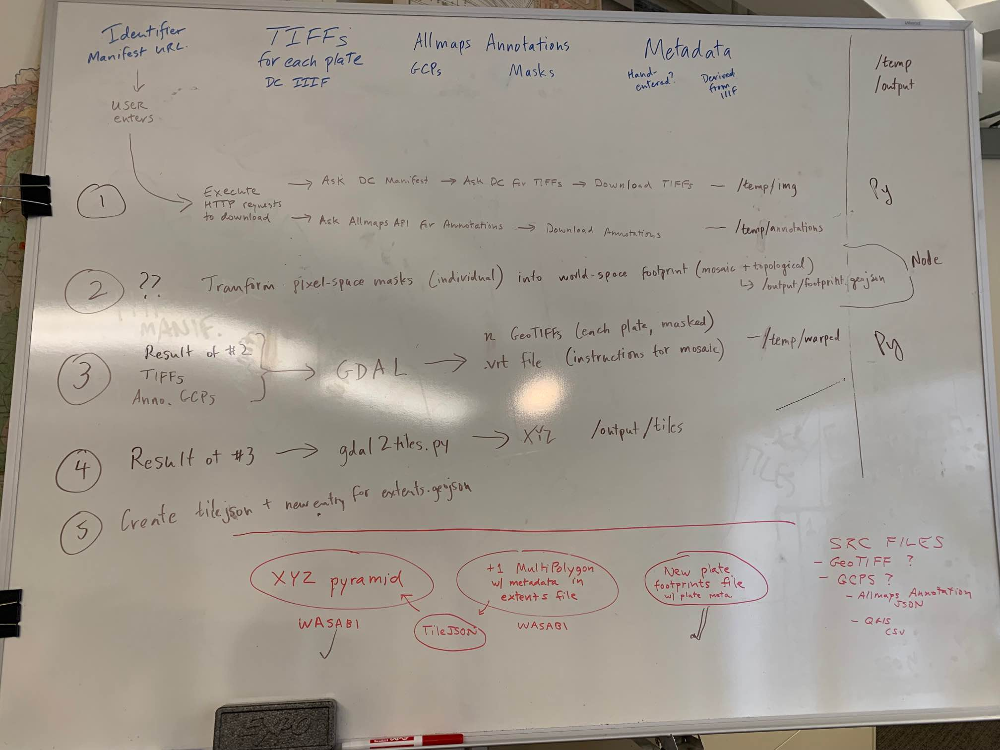

# Geotransforming urban atlases using Allmaps and GDAL

the python script in this repo will do:



## Usage

1. clone this repo and `cd` into it
2. create symbolic link to `atlascopify.py`

```sh
sudo ln -s pwd usr/local/bin
```

3. execute with

```sh
atlascopify.py --identifier <commonwealth:id>
```